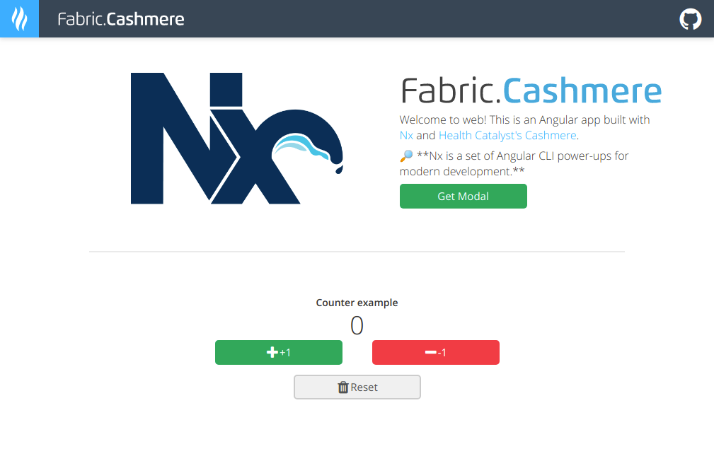
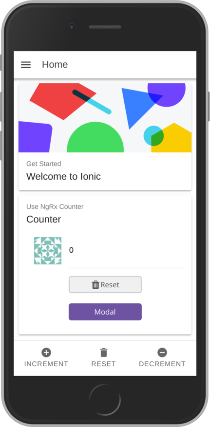

# Nx-based Angular7 web app and an Ionic4 mobile app

## Introduction

This is a proof of concept that demonstrates the ability to share core functionalities and ngrx-based business logic between an Angular7 web app and an Ionic4 mobile app.

It is based on a Nx Workspace mono-repo project structure (from Nrwl.io [Nx Extensions](https://github.com/nrwl/nx), an open source toolkit for enterprise Angular applications).

It is a fork with **latest** packages version & separate UI laibrary, based on [benorama/ngrx-demo-workspace](https://github.com/benorama/ngrx-demo-workspace), so please check his Medium article [Sharing (Ngrx-based) logic between Angular5 web app and Ionic3 mobile app](https://medium.com/@benorama/sharing-ngrx-based-logic-between-angular5-web-app-and-ionic3-mobile-app-77c19470cccc) for more info.

## Screenshots

| Web | Mobile |
|------|------|
|  |  |

**Goals:**

* encapsulate all the business logic in a core module, based on [@ngrx/store](https://github.com/ngrx/platform),
* keep specific view layout, markup and navigation logic in the app projects.

Note: [@ngrx/store](https://github.com/ngrx/platform) is a RxJS powered state management inspired by Redux for Angular apps.
It's currently the most popular way to structure complex business logic in Angular apps.

## Running the apps locally

```bash

# Clone the repo
git clone https://github.com/voznik/nx-workspace.git
# Install dependencies
npm install
```

Prerequisites, latest version of:

* [Typescript](https://www.typescriptlang.org)
* [Angular CLI](https://cli.angular.io)
* [Ionic CLI](http://ionicframework.com/docs/cli/)

WARNING: in order to be able to support Ionic multi-app projects, you'll need the latest Ionic CLI (4.3.0+, with `npm install -g ionic@latest`) and latest NodeJS (v10+) 

### Web app

To run web app, we use the root Nx Project package and Angular CLI.

```bash

# Run the web app locally
ng serve web
```

### Mobile app

To run mobile app, we use the mobile app Ionic package and Ionic CLI.

```bash
# from root folder
# Run the mobile app locally
ng serve mobile
```

## Bugs and feedback

If you have any questions or suggestions to improve the demo app, don't hesitate to submit an issue or a pull request!

---

This project was generated with [Angular CLI](https://github.com/angular/angular-cli) using [Nrwl Nx](https://nrwl.io/nx).
